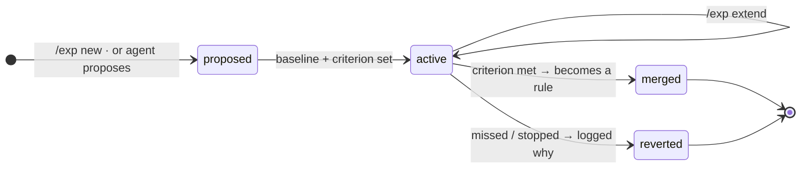
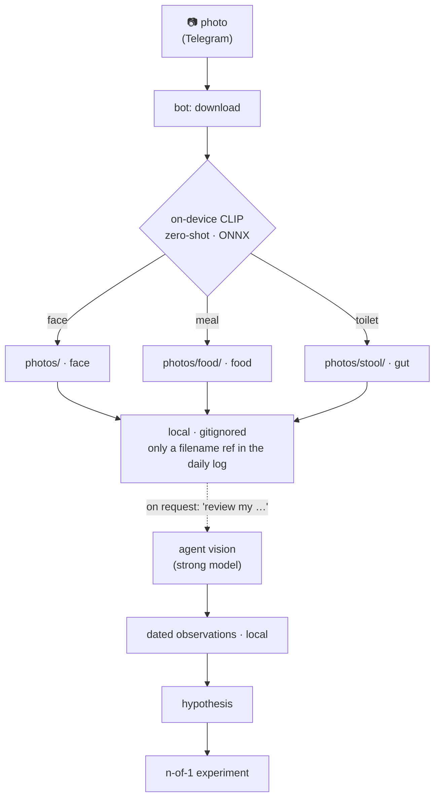
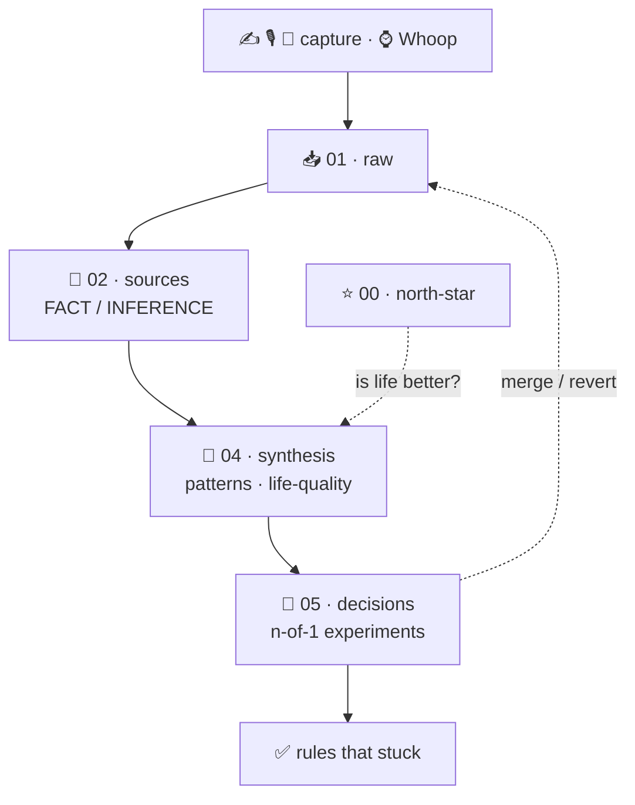

<div align="center">

# 🧬 Harness Health Engineering

### *A local AI lab that helps you discover what actually improves your life.*

Physiology streams in from **Whoop** · lived experience goes in by **text · voice · selfie** ·
an **on-device agent** runs *n-of-1 experiments* and tells you what actually makes life better —
all as plain **Markdown you own**.

<br/>

[](https://cryptoyoginya.github.io/harness-health-engineering/)

<sub>↑ a black-and-white product page · [cryptoyoginya.github.io/harness-health-engineering](https://cryptoyoginya.github.io/harness-health-engineering/)</sub>

<br/>

[](https://cryptoyoginya.github.io/harness-health-engineering/)


</div>

---

### 🧭 Explore

|   |   |   |
|---|---|---|
| ⭐ [The one idea](#the-one-idea) | 🔬 [The engine](#the-engine-n-of-1-experiments-) | 🆚 [vs Whoop journal](#why-its-different-from-whoops-journal) |
| 🔄 [How it works](#how-it-works) | 📥 [Three ways in](#three-ways-in-) | 🤳 [Photo diaries](#three-photo-diaries-one-on-device-eye-) |
| 🧱 [Architecture](#architecture-the-knowledge-pyramid-) | 🛠️ [Technology](#technology) | 🚀 [Deploy your own](./SETUP.md) |

---

## The one idea

Every health gadget you've owned optimised a *number*. Recovery. HRV. Steps. And somewhere along the
way the number became the point, and your actual life — whether you felt good, did meaningful work, saw
people you love — fell out of frame. That's **Goodhart's law** wearing a fitness band: *when a measure
becomes the target, it stops measuring anything that matters.*

This project flips it. The top-level metric here is not a body score. It is one honest question:

> ### ⭐ North-star: *"Is my life actually better?"*

Everything else — recovery, sleep, HRV, supplements, training load — is demoted to what it really is: an
**instrument** in service of that question. The system will happily tell you that your body looks great
this week *and your life doesn't*, and then help you fix the right thing. No wearable can say that,
because no wearable knows what your good life looks like. 

Built for people who have tried enough supplements, trackers, routines, and protocols to know that the hard question is not “what is optimal?” but “what is optimal for me, in the life I actually live?”. Not for people who want motivation, streaks, badges, or a prettier sleep chart.

## The engine: n-of-1 experiments 🔬

Correlations are guesses. "You sleep worse when you drink" can't tell you if the drink did it or if a
hard day caused both. So instead of guessing, the harness runs **n-of-1 trials** — single-subject
experiments, the real methodology personalised medicine uses to decide if something works *for one
specific person*. Every experiment is pre-registered:

| Step | Rule |
|---|---|
| **Hypothesis** | a specific causal claim |
| **One variable** | change exactly one thing — the rule everyone breaks |
| **Baseline** | a measured "before" |
| **Duration + criterion** | written *before* the data, so you can't fool yourself |
| **Verdict** | `merge` → it becomes a standing rule, or `revert` → drop it and log why |

This is the difference between *"I tried a thing once"* and knowledge that compounds. The payoff is a
sentence no tracker will ever give you:

> *"Creatine moved nothing for you in three weeks — stop paying for it."*
> *"Caffeine before 14:00 bought you +35 min of deep sleep — it's a rule now."*

One variable at a time. A clock. A criterion. A verdict that becomes a rule. That's the whole game, and
it's why this gets smarter every week instead of just logging more.



You drive it from anywhere: `/exp new` to start, `/exp extend` to give it more time, `/exp stop` to call
it — or just ask the agent to design a tighter one. Either way it ends in a verdict, not a vibe.

## Why it's different from Whoop's journal

Whoop's journaling is genuinely good — and it has a ceiling. Here's where this goes that it structurally
can't:

| | Wearable journal | Harness Health Engineering |
|---|---|---|
| Top metric | a body score | **your life quality** |
| Evidence | correlation | **n-of-1 causation → rules** |
| Scope | body only | **body × work × people × supplements × bloodwork** |
| Output | dashboards | **decisions and experiments** |
| Reasoning | a black box | **on-device, cited, interrogable in plain language** |
| Memory | a feed | **a versioned record you can ask "why was March hard?"** |
| Guardrail | — | **flags metric-tyranny: proxy up, life flat → that's a fail** |

The discipline is the product. The data is just raw material. The full scientific rationale —
n-of-1 design, surrogate-endpoint failure, evidence labelling, confounding — is in
[`METHODOLOGY.md`](./METHODOLOGY.md).

## How it works


**The loop:** Signal → Ingest → Source note → Synthesis → **Experiment** → Verdict → Rule → repeat.
Objective body data arrives on its own; you add a 40-second diary; on Sundays the agent scores your week
against the north-star and finds what's actually moving it.

## What it tracks

**Daily (auto):** recovery, HRV, resting HR, sleep, strain — from Whoop.
**Daily (you, ~40s — by text, voice, or selfie):** events (your impressions journal), mood, energy,
social, work, movement, supplements.
**Weekly:** one integral *"is life better?"* 1–5. **Quarterly:** six life dimensions — emotion,
connection, body, meaning, autonomy, growth.

## Three ways in 📥

Lived experience is messy, and you shouldn't have to sit at a keyboard to capture it. The bot takes
**three modalities** — mix them freely, several per day:

| Mode | How | Processing | Privacy |
|---|---|---|---|
| ✍️ **Text** | type a line | appended to today's record | local |
| 🎙️ **Voice** | send a voice note | transcribed **on-device** (Whisper ONNX) → text | audio never leaves the machine |
| 🤳 **Selfie** | send a photo | archived to a **local visual diary**, reviewed on demand by the agent | biometric — never committed to git |

A photo is **auto-classified on-device** (CLIP, zero-shot — the image never leaves the machine) into one
of three **local diaries**, each read against its own canon — all descriptive, never diagnostic. No
caption needed; a caption simply overrides the guess:

| Type (auto) | Diary | Canon the agent uses |
|---|---|---|
| selfie *(default)* | face | skin / fluid / affect signals over time |
| food | meals | plate composition · protein · fibre · processing · timing |
| stool | gut | **Bristol Stool Scale** — type, colour, frequency |

Every message lands as a timestamped line `- 14:30 …` in `01_raw/health/YYYY-MM-DD.md`, so the *shape* of
the day is preserved — not flattened into one average. Commands set the rest: `/north` for your
north-star, `/exp` to run an n-of-1, `/week` · `/month` · `/year` for horizons.

## Three photo diaries, one on-device eye 🤳

Your face, your plate, and your gut all leave visible traces of how you live — and a wearable sees none
of them. The harness turns photos into **longitudinal signals**, while staying strictly on the safe side
of the line: it *describes and compares over time*, it never diagnoses.

### The on-device eye: how routing works 👁️

Send any photo — **no caption, no menu**. The bot identifies what it is with **CLIP zero-shot image
classification running locally** (ONNX, the same on-device stack as the voice transcriber). The image
**never leaves the machine**; nothing is uploaded.



- **Selfie is the safe default** — the classifier must clear a confidence margin to file a photo as food
  or stool; otherwise it stays in the neutral face diary.
- **A caption always wins** — write "food" / "stool" / "selfie" to override the guess.
- **Storage is the only automatic step.** Content is never auto-analysed — the deep read happens *only
  when you ask the agent* ("review my selfies / food / stool"), keeping a strong model's quality without
  sending anything anywhere by default. (Warm classification ≈ 150 ms.)

### 1 · Face — the visual diary

**What the agent reads from a face — over time, not in one shot:**

| Group | Signals | May reflect | Cross-checked against |
|---|---|---|---|
| 💧 Fluid / puffiness | under-eye bags, facial fullness, lid heaviness | water retention, fatigue | sleep, salt/alcohol at night, cycle phase, stress |
| 🎨 Skin tone | redness/flush, sallowness, pallor, blotchiness | vascular reaction, tiredness | alcohol, heat/exertion, recovery, hydration |
| 🧴 Texture / breakouts | spot count & location, shine vs dryness | hormonal pattern, hydration | cycle phase, sugar/dairy *(hypothesis)*, stress, sleep |
| 👁️ Eyes | sclera redness, dark circles, clarity of gaze | tiredness, irritation | sleep, alcohol, screens, allergy |
| 🌳 Affect / vitality | jaw/brow tension, downturned vs lit-up | mood, energy | mood/energy 1–5, *"lived as wanted?"* |

### 2 · Food — read against the plate canon

Method: the **plate canon** — ~½ vegetables · ~¼ protein · ~¼ complex carbs · + healthy fat.

| Signal | May reflect | Cross-checked against |
|---|---|---|
| protein present? | satiety, stable glucose | energy, afternoon sugar cravings |
| fibre / veg share | gut transit, fullness | stool, energy |
| processing level (whole vs ultra-processed) | inflammation *(hypothesis)* | mood, energy |
| refined sugar / fast carbs | glucose swings | energy, sleep, skin |
| meal timing (late eating) | overnight recovery | sleep, next-day recovery |

> **No calorie counting** — unreliable from a photo; the agent reads *composition and timing*, not
> numbers. Described **neutrally, never moralised** — an eating-disorder guardrail keeps the focus on
> *food → how you feel*, not control or guilt.

### 3 · Gut — the Bristol Stool Scale

Method: the clinical **Bristol Stool Scale** (type 1–7, with 3–4 as the healthy middle) plus colour.

| Read | May reflect | Cross-checked against |
|---|---|---|
| type 1–2 (hard lumps) | slow transit, constipation-leaning | water, fibre, magnesium, travel |
| type 3–4 | normal | — |
| type 6–7 (loose / watery) | fast transit | trigger foods, stress, FODMAPs, caffeine |
| colour (pale-clay · black-tarry · red) | bile flow · possible bleed | **red-flag → doctor** |

> Black/tarry stool or visible blood → **see a doctor**, not a diary entry — no interpretation attempted.

### Hard limits, across all three diaries

- **Not a diagnosis** — any worrying sign resolves to *"see a doctor,"* never an interpretation.
- **Constitution ≠ trend** — innate features (dark circles, face shape) are constants, not changes.
- **Shooting noise** — light, angle, makeup, time of day distort more than physiology; mismatched shots → low confidence.
- **Biology lags** — skin breakouts (and gut shifts) surface days after a trigger; never pinned to "yesterday."
- **One shot ≠ a pattern** — value is the trend; strongest evidence = **paired shots, *"morning after X vs morning without X"*** — already almost an n-of-1.

## Architecture: the knowledge pyramid 🧱

Everything is plain Markdown in a **layered pyramid** — raw signal at the base, decisions at the top.
Each layer only consumes the one below it, so evidence flows *upward* and nothing is asserted without a
trail back to its source.

| Layer | Holds | Example |
|---|---|---|
| ⭐ `00_context` | north-star, metrics, the domain frame | *"is life better?"*, leading vs lagging metrics |
| 📥 `01_raw` | daily records — you + Whoop | `2026-06-13.md`, photos, voice notes |
| 🔖 `02_sources` | weekly notes, evidence-labelled | `FACT` / `INFERENCE` per week |
| 📚 `03_wiki` | what you've learned, baselines | personal HRV, supplement stack |
| 🧩 `04_synthesis` | patterns + life-quality | the cross-layer story |
| 🔬 `05_decisions` | **n-of-1 experiments** | one variable · criterion · verdict |
| 🎁 `06_outputs` | finished artefacts | specs, talks |



The retrieval, hooks, and agent all read this pyramid — never raw guesses. The full scientific rationale
lives in [`METHODOLOGY.md`](./METHODOLOGY.md); the layer contracts in [`AGENTS.md`](./AGENTS.md).

## Technology

| Layer | Stack |
|---|---|
| Ingest | Whoop API v2, OAuth2 (serialized, race-safe token refresh), Node 22, zero-dep |
| Capture | free Telegram bot (local, long-polling) — **text · voice · selfie** — + Markdown |
| Voice | `whisper` (ONNX, on-device) + prebuilt `ffmpeg-static` — transcription, audio never leaves the device |
| Vision | on-device CLIP (ONNX) auto-routes photos → selfie / food / stool diaries; deep review by agent on demand — non-diagnostic |
| Knowledge base | layered Markdown pyramid `00→06` with frontmatter contracts + evidence labels |
| Retrieval | hybrid RAG — `multilingual-e5-small` (ONNX) + `sqlite-vec` + FTS5 BM25, fused via RRF |
| Agent | MCP server (`kb_search` / `kb_think` / `kb_backlinks`) for any MCP client |
| Control plane | Claude Code hooks (evidence + frontmatter linters), permissions, working-memory invariant |
| Automation | macOS `launchd` — morning sync + brief, hands-off |
| Quality | `kb-doctor` health-check, weekly `dream-cycle` audit |

## Quickstart

> 📖 **Standing up your own copy?** Follow the full step-by-step in **[`SETUP.md`](./SETUP.md)** —
> Telegram bot, Whoop app, `.env`, auto-start, and an honest privacy breakdown.

```bash
corepack enable
pnpm run setup
cp .env.example .env            # WHOOP + Telegram bot tokens
pnpm whoop:auth                 # one-time OAuth → .whoop/ (gitignored)
pnpm whoop:sync                 # pull physiology + push a morning brief
pnpm kb:index
pnpm kb:think "what actually moves my life quality?"
pnpm kb:doctor
```

Daily rhythm: **morning** sync + brief run themselves · **evening** text/voice/photo your diary to the
bot · **Sunday** ask the agent to *review the week*.

## Privacy & safety

**Local-first, but honest about the edges.** Your record lives on your disk; pre-processing
(voice→text, photo-type, search) runs **on-device**; photos and sensitive diaries are git-ignored and
never pushed; secrets (`.env`, `.whoop/`) are git-ignored and `deny`-read by the agent. What *does*
leave the machine, by design: messages transit **Telegram** (the Bot API is not end-to-end encrypted),
**Claude/Anthropic** processes what you send the agent to analyse, and **Whoop** returns your
physiology. Nothing is sold or posted publicly. Full breakdown in [`SETUP.md`](./SETUP.md).

**Not a medical device.** The agent never diagnoses; any worrying signal resolves to one
recommendation — see a specialist.

## Contributing

Built as one person's body-as-codebase, designed to generalise to any self-quantifier. PRs especially
welcome on: wearable adapters (Oura, Garmin, Apple Health), a live Whoop MCP server, richer experiment
designs, and synthesis evals. See [`CONTRIBUTING.md`](./CONTRIBUTING.md) and the open
[issues](https://github.com/cryptoyoginya/harness-health-engineering/issues). *(Yes, Bryan, you too.)*

## License

MIT © 2026 Christina Vinter. See [`LICENSE`](./LICENSE).
