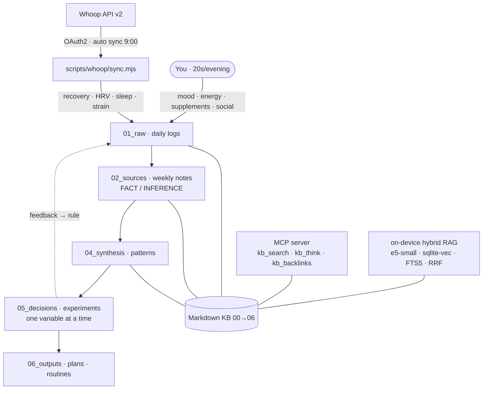

# 🧬 Harness Health Engineering

> **A Bryan-Johnson-grade health operating system you actually own.** Your body's objective signals
> flow in automatically from Whoop; your subjective signals (mood, energy, social) flow in by hand;
> an on-device AI agent finds the patterns at the seam — all as plain Markdown on your machine.


---

## The thesis

Quantified-self tools measure a lot and *change* almost nothing. They live in silos, they read your
body but never your mind, and they hand you dashboards instead of decisions. **Harness Health
Engineering** treats your health like a long-running engineering project:

- **Whoop is your linter for the body** — morning recovery surfaces the "error" *before* you compile
  it into overtraining or burnout.
- **The repo is your memory** — every day is durable, versioned, searchable evidence, not a number
  that scrolls off a feed.
- **The agent is your synthesis layer** — it correlates *objective* physiology with *subjective*
  state, the one place no wearable can reach.

The whole system is **local-first**: the only thing that ever leaves your machine is the outbound
call to Whoop to pull your own numbers.

## How it works



The cycle: **Signal → Ingest → Source note → Synthesis → Decision/experiment → Output → Feedback →
Iterate.** Each loop makes you *measurably smarter about yourself*, instead of "I tried a thing once."

## What it tracks (multi-dimensional, Blueprint-style)

Sleep & recovery · supplement stack + adherence · training load · activity types · nutrition timing ·
**socialization** · mental state (mood / energy / anxiety). Objective from Whoop, subjective by hand,
**value at the intersection.**

## Why it's different

| | Typical wearable app | Harness Health Engineering |
|---|---|---|
| Data ownership | Their cloud | **Your disk, plain Markdown** |
| Mind + body | Body only | **Both — correlated in synthesis** |
| Output | Dashboards | **Decisions & experiments** |
| Memory | A feed | **Versioned, searchable KB** |
| AI | Black box | **On-device RAG you can read** |
| Rigor | Vibes | **FACT/INFERENCE labels, one variable per experiment** |
| Safety | — | **Hard medical boundary: no diagnoses → see a doctor** |

## Technology

| Layer | Stack |
|---|---|
| Ingest | Whoop API v2, OAuth2 (authorization-code + refresh), Node 22 (no deps) |
| Knowledge base | Markdown layer pyramid `00_context → 06_outputs` with frontmatter contracts |
| Retrieval | Hybrid RAG — `multilingual-e5-small` (ONNX via transformers.js) + `sqlite-vec` (vectors) + SQLite **FTS5** (BM25), fused with **Reciprocal Rank Fusion** |
| Agent interface | MCP server exposing `kb_search` / `kb_think` / `kb_backlinks` to any MCP client |
| Control plane | Claude Code hooks (SessionStart context, PreToolUse evidence + frontmatter linters), permissioned tools, working-memory invariant |
| Automation | macOS `launchd` agent runs the morning sync at 09:00, fully hands-off |
| Quality | `kb-doctor` health-check, weekly `dream-cycle` LLM audit |
| Viewer | Vite + React graph/search UI (optional, localhost) |

See [`ARCHITECTURE.md`](./ARCHITECTURE.md) for the deep dive.

## Quickstart

```bash
corepack enable
pnpm run setup                 # semantic + skillopt + viewer sub-packages
cp .env.example .env           # add WHOOP_CLIENT_ID / WHOOP_CLIENT_SECRET
pnpm whoop:auth                # one-time OAuth (browser → .whoop/token.json, gitignored)
pnpm whoop:sync                # pull physiology into today's log
pnpm kb:index                  # build the semantic index (first run downloads ~120 MB ONNX)
pnpm kb:think "why did my mood drop this week?"
pnpm kb:doctor                 # KB health-check
```

Then the daily rhythm is: **morning** sync runs itself · **evening** log one line ·
**Sunday** ask the agent to *synthesize the week*.

Evening logging is easiest via the **Telegram bot** (`scripts/bot/`) — a free, zero-dependency,
local "dumb collector" that drops whatever you text it into today's log. No LLM, no API key: the
reasoning stays with the agent in Claude Code. See [`scripts/bot/README.md`](./scripts/bot/README.md).

## Privacy & safety

- **Local-first.** Your health data lives in this repo on your disk. Nothing is sent anywhere except
  the Whoop API call that fetches your own data.
- **Secrets never committed.** `.env` and `.whoop/` (OAuth tokens) are gitignored and `deny`-read by
  the agent.
- **Not a medical device.** The agent never diagnoses or interprets symptoms as conditions. Any
  worrying signal resolves to a single recommendation: *see a specialist.*

## Contributing

This started as one person's body-as-codebase — but the architecture generalizes to any
self-quantifier. **PRs welcome**, especially: more wearable adapters (Oura, Garmin, Apple Health), a
live Whoop MCP server, richer experiment templates, and synthesis evals. If you're building the
future of human optimization and this resonates — open an issue, let's talk. *(Yes, Bryan, this
includes you.)*

See [`CONTRIBUTING.md`](./CONTRIBUTING.md).

## License

MIT © 2026 Christina Vinter. See [`LICENSE`](./LICENSE).
