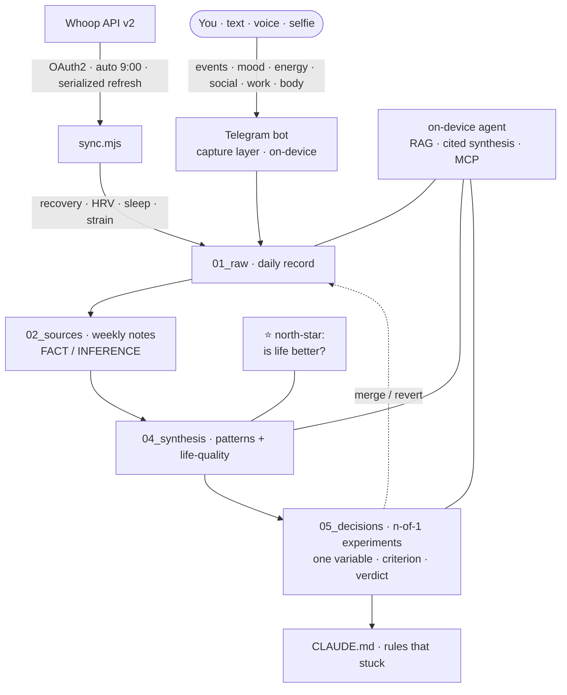
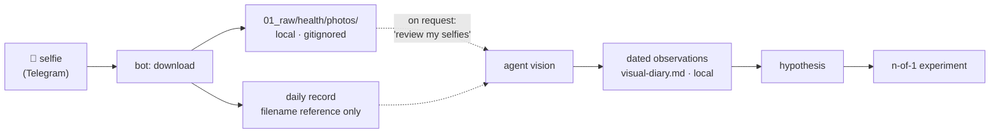

# 🧬 Harness Health Engineering

> **A local AI lab that helps you discover what actually improves your life.**
> Your physiology streams in automatically from Whoop; your lived experience goes in by text, voice, or
> selfie; an on-device AI agent runs *n-of-1 experiments* on you and tells you what actually
> makes your life better. All as plain Markdown you own.


---

## The one idea

Every health gadget you've owned optimised a *number*. Recovery. HRV. Steps. And somewhere along the
way the number became the point, and your actual life — whether you felt good, did meaningful work, saw
people you love — fell out of frame. That's **Goodhart's law** wearing a fitness band: *when a measure
becomes the target, it stops measuring anything that matters.*

This project flips it. The top-level metric here is not a body score. It is one honest question:

> ### ⭐ North-star: *"Is my life actually better?"*

Everything else — recovery, sleep, HRV, supplements, training load — is demoted to what it really is: an
**instrument** in service of that question. The system will happily tell you that your body looks great
this week *and your life doesn't*, and then help you fix the right thing. No wearable can say that,
because no wearable knows what your good life looks like. 

Built for people who have tried enough supplements, trackers, routines, and protocols to know that the hard question is not “what is optimal?” but “what is optimal for me, in the life I actually live?”. Not for people who want motivation, streaks, badges, or a prettier sleep chart.

## The engine: n-of-1 experiments 🔬

Correlations are guesses. "You sleep worse when you drink" can't tell you if the drink did it or if a
hard day caused both. So instead of guessing, the harness runs **n-of-1 trials** — single-subject
experiments, the real methodology personalised medicine uses to decide if something works *for one
specific person*. Every experiment is pre-registered:

| Step | Rule |
|---|---|
| **Hypothesis** | a specific causal claim |
| **One variable** | change exactly one thing — the rule everyone breaks |
| **Baseline** | a measured "before" |
| **Duration + criterion** | written *before* the data, so you can't fool yourself |
| **Verdict** | `merge` → it becomes a standing rule, or `revert` → drop it and log why |

This is the difference between *"I tried a thing once"* and knowledge that compounds. The payoff is a
sentence no tracker will ever give you:

> *"Creatine moved nothing for you in three weeks — stop paying for it."*
> *"Caffeine before 14:00 bought you +35 min of deep sleep — it's a rule now."*

One variable at a time. A clock. A criterion. A verdict that becomes a rule. That's the whole game, and
it's why this gets smarter every week instead of just logging more.

## Why it's different from Whoop's journal

Whoop's journaling is genuinely good — and it has a ceiling. Here's where this goes that it structurally
can't:

| | Wearable journal | Harness Health Engineering |
|---|---|---|
| Top metric | a body score | **your life quality** |
| Evidence | correlation | **n-of-1 causation → rules** |
| Scope | body only | **body × work × people × supplements × bloodwork** |
| Output | dashboards | **decisions and experiments** |
| Reasoning | a black box | **on-device, cited, interrogable in plain language** |
| Memory | a feed | **a versioned record you can ask "why was March hard?"** |
| Guardrail | — | **flags metric-tyranny: proxy up, life flat → that's a fail** |

The discipline is the product. The data is just raw material. The full scientific rationale —
n-of-1 design, surrogate-endpoint failure, evidence labelling, confounding — is in
[`METHODOLOGY.md`](./METHODOLOGY.md).

## How it works



**The loop:** Signal → Ingest → Source note → Synthesis → **Experiment** → Verdict → Rule → repeat.
Objective body data arrives on its own; you add a 40-second diary; on Sundays the agent scores your week
against the north-star and finds what's actually moving it.

## What it tracks

**Daily (auto):** recovery, HRV, resting HR, sleep, strain — from Whoop.
**Daily (you, ~40s — by text, voice, or selfie):** events (your impressions journal), mood, energy,
social, work, movement, supplements.
**Weekly:** one integral *"is life better?"* 1–5. **Quarterly:** six life dimensions — emotion,
connection, body, meaning, autonomy, growth.

## Three ways in 📥

Lived experience is messy, and you shouldn't have to sit at a keyboard to capture it. The bot takes
**three modalities** — mix them freely, several per day:

| Mode | How | Processing | Privacy |
|---|---|---|---|
| ✍️ **Text** | type a line | appended to today's record | local |
| 🎙️ **Voice** | send a voice note | transcribed **on-device** (Whisper ONNX) → text | audio never leaves the machine |
| 🤳 **Selfie** | send a photo | archived to a **local visual diary**, reviewed on demand by the agent | biometric — never committed to git |

Every message lands as a timestamped line `- 14:30 …` in `01_raw/health/YYYY-MM-DD.md`, so the *shape* of
the day is preserved — not flattened into one average. Commands set the rest: `/north` for your
north-star, `/exp` to run an n-of-1, `/week` · `/month` · `/year` for horizons.

## The visual diary 🤳

Skin, puffiness, and the *spark* in a face shift with sleep, salt, alcohol, stress, and cycle — a
wearable is blind to all of it. The harness turns selfies into a **longitudinal signal**, while staying
strictly on the safe side of the line: it *describes and compares over time*, it never diagnoses.



The **only automatic step is storage.** No image is ever auto-analysed, uploaded, or committed.
Comparison happens *only when you ask*, using the agent's vision — keeping a strong model's quality
without sending your face anywhere by default.

**What the agent reads from a face — over time, not in one shot:**

| Group | Signals | May reflect | Cross-checked against |
|---|---|---|---|
| 💧 Fluid / puffiness | under-eye bags, facial fullness, lid heaviness | water retention, fatigue | sleep, salt/alcohol at night, cycle phase, stress |
| 🎨 Skin tone | redness/flush, sallowness, pallor, blotchiness | vascular reaction, tiredness | alcohol, heat/exertion, recovery, hydration |
| 🧴 Texture / breakouts | spot count & location, shine vs dryness | hormonal pattern, hydration | cycle phase, sugar/dairy *(hypothesis)*, stress, sleep |
| 👁️ Eyes | sclera redness, dark circles, clarity of gaze | tiredness, irritation | sleep, alcohol, screens, allergy |
| 🌳 Affect / vitality | jaw/brow tension, downturned vs lit-up | mood, energy | mood/energy 1–5, *"lived as wanted?"* |

**Hard limits, by design:**

- **Not a diagnosis** — any worrying sign resolves to *"see a doctor,"* never an interpretation.
- **Constitution ≠ trend** — innate dark circles or face shape are constants, not changes.
- **Shooting noise** — light, angle, makeup, time of day distort more than physiology; mismatched shots → low confidence.
- **Skin lags** — breakouts surface days after a trigger; never pinned to "yesterday."
- **Strongest evidence = paired shots** — *"morning after X vs morning without X"* — which is already almost an n-of-1.

## Technology

| Layer | Stack |
|---|---|
| Ingest | Whoop API v2, OAuth2 (serialized, race-safe token refresh), Node 22, zero-dep |
| Capture | free Telegram bot (local, long-polling) — **text · voice · selfie** — + Markdown |
| Voice | `whisper` (ONNX, on-device) + prebuilt `ffmpeg-static` — transcription, audio never leaves the device |
| Vision | local visual diary (gitignored) + agent vision on demand — non-diagnostic, longitudinal |
| Knowledge base | layered Markdown pyramid `00→06` with frontmatter contracts + evidence labels |
| Retrieval | hybrid RAG — `multilingual-e5-small` (ONNX) + `sqlite-vec` + FTS5 BM25, fused via RRF |
| Agent | MCP server (`kb_search` / `kb_think` / `kb_backlinks`) for any MCP client |
| Control plane | Claude Code hooks (evidence + frontmatter linters), permissions, working-memory invariant |
| Automation | macOS `launchd` — morning sync + brief, hands-off |
| Quality | `kb-doctor` health-check, weekly `dream-cycle` audit |

## Quickstart

```bash
corepack enable
pnpm run setup
cp .env.example .env            # WHOOP + Telegram bot tokens
pnpm whoop:auth                 # one-time OAuth → .whoop/ (gitignored)
pnpm whoop:sync                 # pull physiology + push a morning brief
pnpm kb:index
pnpm kb:think "what actually moves my life quality?"
pnpm kb:doctor
```

Daily rhythm: **morning** sync + brief run themselves · **evening** text your diary to the bot ·
**Sunday** ask the agent to *review the week*.

## Privacy & safety

Local-first — your record lives on your disk; the only egress is the Whoop call that fetches *your* data.
Secrets (`.env`, `.whoop/`) are gitignored and `deny`-read by the agent. **Not a medical device:** the
agent never diagnoses; any worrying signal resolves to one recommendation — see a specialist.

## Contributing

Built as one person's body-as-codebase, designed to generalise to any self-quantifier. PRs especially
welcome on: wearable adapters (Oura, Garmin, Apple Health), a live Whoop MCP server, richer experiment
designs, and synthesis evals. See [`CONTRIBUTING.md`](./CONTRIBUTING.md) and the open
[issues](https://github.com/cryptoyoginya/harness-health-engineering/issues). *(Yes, Bryan, you too.)*

## License

MIT © 2026 Christina Vinter. See [`LICENSE`](./LICENSE).
