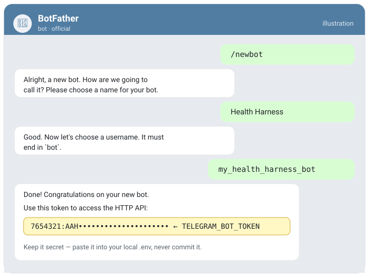
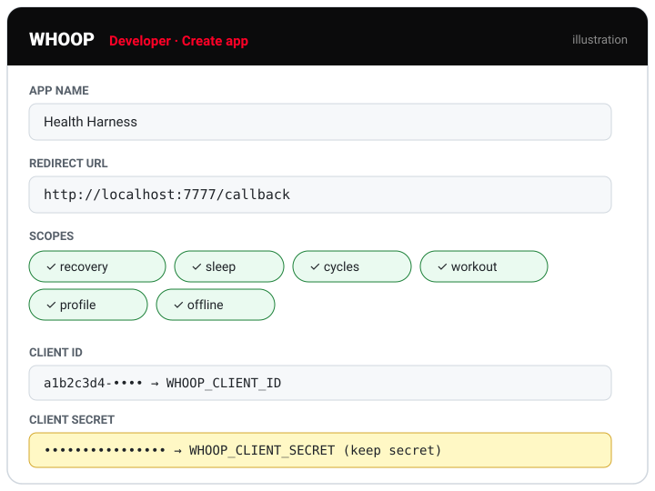

<div align="center">

# 🛠️ Deploy your own harness

*From zero to a running, private, self-experimenting health lab — in about 20 minutes.*

</div>

This is the full flow for someone who wants to stand up their **own** copy. It's local-first: everything
runs on your machine. You'll wire up two free accounts (a Telegram bot + a Whoop developer app),
drop their keys into one `.env`, and start the loop.

> **Honest scope of "private."** Pre-processing (voice→text, photo-type, search) runs **on your device**,
> and your files live on **your disk** (photos and sensitive diaries are git-ignored — never pushed).
> But two things do leave the machine, by design: messages transit **Telegram** (the Bot API is not
> end-to-end encrypted), and **deep analysis uses Claude** (Anthropic) when you ask the agent to review.
> Whoop holds your physiology (it's your data, fetched from them). No data is sold, and nothing is
> posted publicly.

---

## What you'll need

| | |
|---|---|
| 💻 **OS** | macOS (auto-start uses `launchd`). Linux/Windows work too — the bot is plain Node; use `cron`/Task Scheduler for automation. |
| ⬢ **Node 22** | via the bundled `.nvmrc` (`nvm use`) or any Node 22 install |
| 📦 **pnpm** | enabled with `corepack enable` |
| 🤖 **Telegram** | a bot token from [@BotFather](https://t.me/BotFather) (free) |
| ⌚ **Whoop** | a developer app at [developer.whoop.com](https://developer.whoop.com) (free; you need a Whoop device for live data) |
| 🧠 **The agent** | [Claude Code](https://claude.com/claude-code) (or any MCP client) for the weekly analysis |

> First run downloads on-device ML models (~120 MB embeddings + Whisper + CLIP) from HuggingFace once,
> then everything runs offline.

---

## 1 · Get the code

```bash
git clone https://github.com/cryptoyoginya/harness-health-engineering.git
cd harness-health-engineering
corepack enable
pnpm run setup          # installs all sub-packages (semantic, bot, skillopt, viewer)
```

## 2 · Create your Telegram bot

1. Message [@BotFather](https://t.me/BotFather) → `/newbot` → follow prompts → copy the **token**.
2. You'll add the token in step 4. Your `chat_id` is filled in automatically on first run (step 6).



<sub>*Illustration of the flow — your real token replaces the redacted one. Keep it out of git.*</sub>

## 3 · Create your Whoop developer app

1. Open the [Whoop Developer Dashboard](https://developer.whoop.com) → **new app**.
2. **Redirect URL:** `http://localhost:7777/callback`
3. **Scopes:** `recovery` · `sleep` · `cycles` · `workout` · `profile` · `offline`
4. Copy the **Client ID** and **Client Secret**.



<sub>*Illustration of the form — redirect URL and scopes are exactly what you need; credentials are redacted.*</sub>

## 4 · Configure `.env`

```bash
cp .env.example .env
```

Fill it in:

```ini
# Whoop
WHOOP_CLIENT_ID=your_client_id
WHOOP_CLIENT_SECRET=your_client_secret
WHOOP_REDIRECT_URI=http://localhost:7777/callback

# Telegram
TELEGRAM_BOT_TOKEN=token_from_botfather
TELEGRAM_CHAT_ID=            # leave empty for now — the bot reports it on first message
```

> `.env` and `.whoop/` (your tokens) are git-ignored and `deny`-read by the agent. They never leave.

## 5 · Build the search index

```bash
pnpm kb:index           # first run downloads the embedding model (~120 MB), then indexes the Markdown
```

## 6 · Authorise Whoop, then lock the bot to your chat

```bash
pnpm whoop:auth         # opens a browser → approve → saves a refresh token to .whoop/ (git-ignored)
pnpm whoop:sync         # pulls today's physiology + sends a morning brief if the bot is set up
```

Start the bot and bind it to you:

```bash
pnpm bot                # long-polling, no server needed
```

Send it **any message** → it replies with your `chat_id`. Paste that into `.env` as
`TELEGRAM_CHAT_ID=…`, then restart `pnpm bot`. Now it only accepts **your** chat and logs nothing from
anyone else.

## 7 · Set your north-star

In the bot:

```
/north больше энергии и тёплых связей, меньше тревоги
```

This is the direction the whole system optimises toward. Without it, the agent optimises blind.

## 8 · Keep it running (auto)

**macOS — bot always on (LaunchAgent):**

```bash
cp scripts/bot/com.health-harness.bot.plist.example ~/Library/LaunchAgents/com.health-harness.bot.plist
# edit the paths inside if your clone isn't in the default location, then:
launchctl bootstrap gui/$(id -u) ~/Library/LaunchAgents/com.health-harness.bot.plist
```

**Morning Whoop sync (8–9:00) — `cron`:**

```cron
0 9 * * * cd /path/to/harness-health-engineering && /usr/bin/env pnpm whoop:sync >> .whoop/sync.log 2>&1
```

(Linux/Windows: run `pnpm bot` under your process manager of choice; schedule `pnpm whoop:sync` with
`cron` / Task Scheduler.)

## 9 · The daily & weekly loop

- **Morning** — sync + a body brief land on their own.
- **Anytime** — text, voice, or photo the bot (it auto-detects selfie / food / stool). Several a day is
  better than one. `/whoop` · `/week` · `/exp` for quick reads.
- **Sunday** — open the agent in the repo and say **"разбери неделю"** (*review my week*):

  ```bash
  cd /path/to/harness-health-engineering && claude
  ```

  The agent reads 7 days, finds patterns, scores them against your north-star, and proposes or judges an
  n-of-1 experiment. `/month` and `/year` open up as data accumulates.

---

## Health-check & troubleshooting

```bash
pnpm kb:doctor          # frontmatter / broken links / orphans — should exit 0
```

| Symptom | Fix |
|---|---|
| `claude: command not found` | install the CLI: `npm install -g @anthropic-ai/claude-code`, or open the repo folder in the Claude app |
| Whoop `refresh failed` repeatedly | re-link: `pnpm whoop:auth` |
| Bot silent / `409 Conflict` in `.bot/bot.log` | only one bot instance may poll at once — stop duplicates |
| First voice/photo is slow | the on-device model is loading into memory; subsequent ones are ~seconds |
| Bot replies "Не авторизовано" | your `TELEGRAM_CHAT_ID` doesn't match — paste the id the bot reported |

---

## What stays private vs what leaves (at a glance)

| Stays on your machine | Leaves the machine |
|---|---|
| All Markdown logs, photos, voice files | Messages transit **Telegram** (not E2E encrypted) |
| Voice→text (Whisper), photo-type (CLIP), search (e5) — on-device ONNX | **Claude/Anthropic** sees what you send the agent to analyse |
| Tokens (`.env`, `.whoop/`) — git-ignored, deny-read | **Whoop** API returns your physiology |
| Photos & sensitive diaries — git-ignored, never pushed | First-run **model downloads** from HuggingFace (download only) |

The science behind it all is in [`METHODOLOGY.md`](./METHODOLOGY.md); the architecture in
[`README.md`](./README.md#architecture-the-knowledge-pyramid-) and [`AGENTS.md`](./AGENTS.md).
